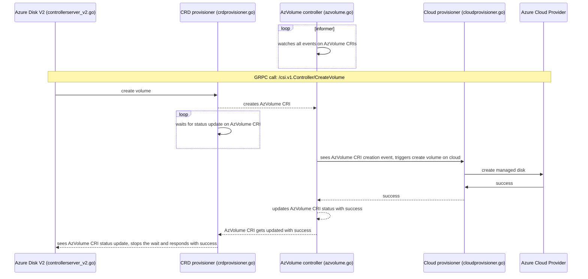

## CreateVolume (Dynamic provisioning)     

```mermaid
    sequenceDiagram      
    %% setup  
        participant driver as Azure Disk V2 (controllerserver_v2.go) 
        participant crdProvisioner as CRD provisioner (crdprovisioner.go)
        participant azVolController as AzVolume controller (azvolume.go)
        participant cloudProvisioner as Cloud provisioner (cloudprovisioner.go)
        participant azure as Azure Cloud Provider
            
        loop informer
            azVolController->>azVolController: watches all events on AzVolume CRIs
        end
        Note over driver, azure: GRPC call: /csi.v1.Controller/CreateVolume
            
    %% request
        driver ->> crdProvisioner: create volume 

        crdProvisioner -->> azVolController: creates AzVolume CRI 

        loop      
            crdProvisioner ->> crdProvisioner: waits for status update on AzVolume CRI
        end

        azVolController ->> cloudProvisioner: sees AzVolume CRI creation event, triggers create volume on cloud

        cloudProvisioner ->> azure: create managed disk
            
    %% response
        azure ->> cloudProvisioner: success

        cloudProvisioner -->> azVolController: success    

        azVolController -->> azVolController: updates AzVolume CRI status with success

        azVolController -->> crdProvisioner: AzVolume CRI gets updated with success

        crdProvisioner -->> driver: sees AzVolume CRI status update, stops the wait and responds with success
```