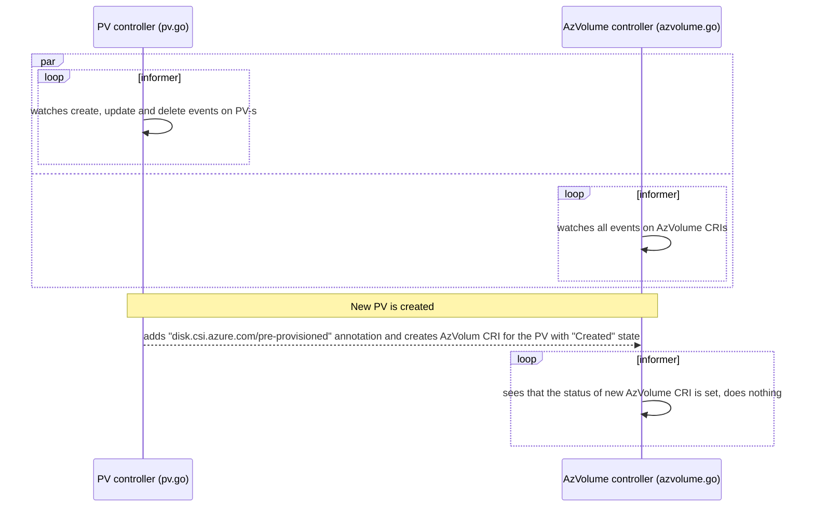

## CreateVolume (Static provisioning)     

```mermaid
    sequenceDiagram      
    %% setup  
        participant pvController as PV controller (pv.go) 
        participant azVolController as AzVolume controller (azvolume.go)

        par 
            loop informer
                pvController ->> pvController: watches create, update and delete events on PV-s
            end
        and
            loop informer
                azVolController ->> azVolController: watches all events on AzVolume CRIs
            end
        end

        Note over pvController, azVolController: New PV is created
            
    %% trigger
        pvController -->> azVolController: adds "disk.csi.azure.com/pre-provisioned" annotation and creates AzVolum CRI for the PV with "Created" state
    
        loop informer
            azVolController ->> azVolController: sees that the status of new AzVolume CRI is set, does nothing
        end
```
