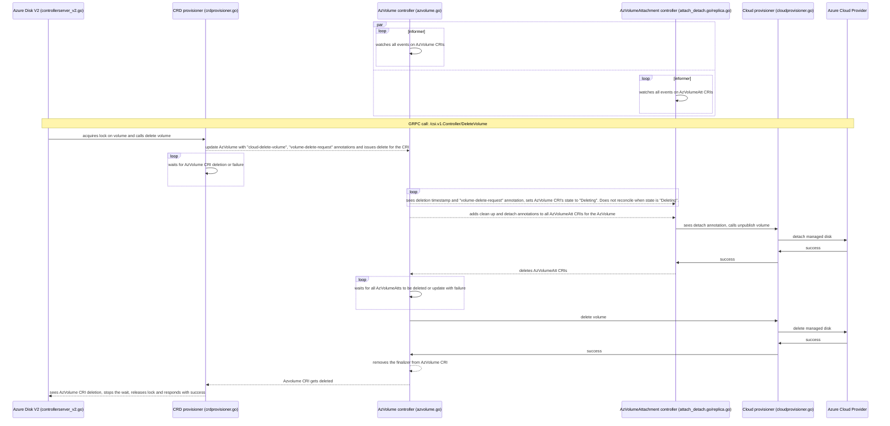

## DeleteVolume

```mermaid
    sequenceDiagram      
    %% setup  
        participant driver as Azure Disk V2 (controllerserver_v2.go) 
        participant crdProvisioner as CRD provisioner (crdprovisioner.go)
        participant azVolController as AzVolume controller (azvolume.go)
        participant azVolAttController as AzVolumeAttachment controller (attach_detach.go/replica.go)
        participant cloudProvisioner as Cloud provisioner (cloudprovisioner.go)
        participant azure as Azure Cloud Provider

        par 
            loop informer
                azVolController ->> azVolController: watches all events on AzVolume CRIs
            end
        and 
            loop informer
                azVolAttController ->> azVolAttController: watches all events on AzVolumeAtt CRIs
            end
        end

        Note over driver, azure: GRPC call: /csi.v1.Controller/DeleteVolume

    %% request
        driver ->> crdProvisioner: acquires lock on volume and calls delete volume 

        crdProvisioner -->> azVolController: update AzVolume with "cloud-delete-volume", "volume-delete-request" annotations and issues delete for the CRI

        loop 
            crdProvisioner ->> crdProvisioner: waits for AzVolume CRI deletion or failure
        end

        loop 
            azVolController -->> azVolAttController: sees deletion timestamp and  "volume-delete-request" annotation, sets AzVolume CRI's state to "Deleting". Does not reconcile when state is "Deleting".
        end

        azVolController -->> azVolAttController: adds clean up and detach annotations to all AzVolumeAtt CRIs for the AzVolume

        azVolAttController ->> cloudProvisioner: sees detach annotation, calls unpublish volume

    %% detach response
        cloudProvisioner ->> azure: detach managed disk

        azure ->> cloudProvisioner: success

        cloudProvisioner ->> azVolAttController: success

        azVolAttController -->> azVolController: deletes AzVolumeAtt CRIs

    %% delete volume request
        loop 
            azVolController ->> azVolController: waits for all AzVolumeAtts to be deleted or update with failure 
        end

        azVolController ->> cloudProvisioner: delete volume

        cloudProvisioner ->> azure: delete managed disk

    %% response
        azure ->> cloudProvisioner : success

        cloudProvisioner ->> azVolController: success

        azVolController -->> azVolController: removes the finalizer from AzVolume CRI

        azVolController -->> crdProvisioner: Azvolume CRI gets deleted

        crdProvisioner -->> driver: sees AzVolume CRI deletion, stops the wait, releases lock and responds with success
```