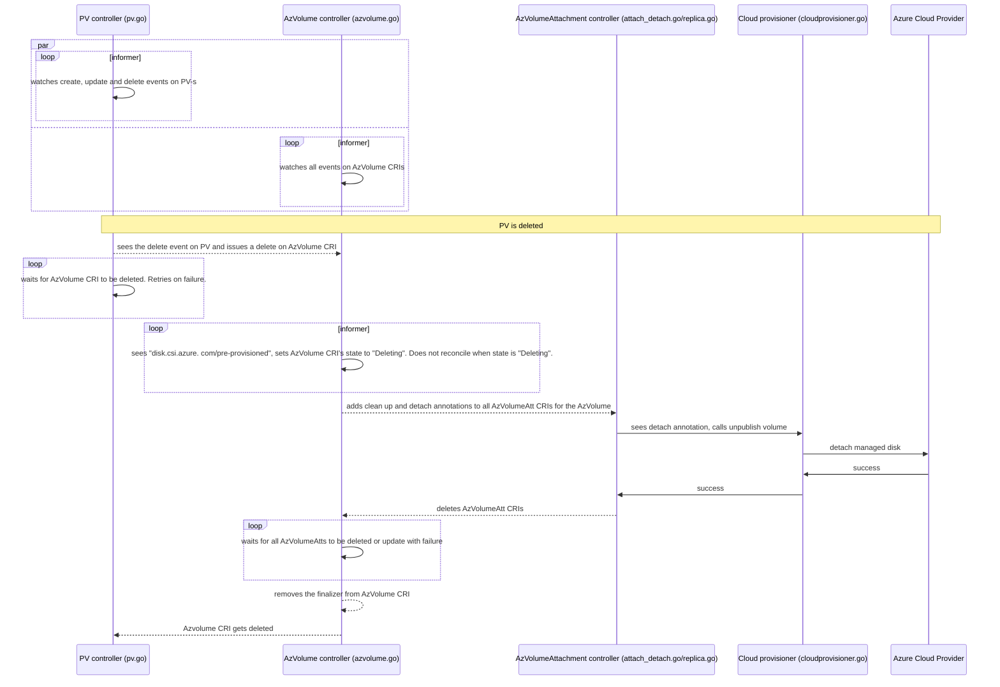

## DeleteVolume (Static provisioning)     

```mermaid
    sequenceDiagram      
    %% setup  
        participant pvController as PV controller (pv.go) 
        participant azVolController as AzVolume controller (azvolume.go)
        participant azVolAttController as AzVolumeAttachment controller (attach_detach.go/replica.go)
        participant cloudProvisioner as Cloud provisioner (cloudprovisioner.go)
        participant azure as Azure Cloud Provider

        par 
            loop informer
                pvController ->> pvController: watches create, update and delete events on PV-s
            end
        and
            loop informer
                azVolController ->> azVolController: watches all events on AzVolume CRIs
            end
        end

        Note over pvController, azure: PV is deleted
            
    %% trigger
        pvController -->> azVolController: sees the delete event on PV and issues a delete on AzVolume CRI
         
        loop 
            pvController ->> pvController: waits for AzVolume CRI to be deleted. Retries on failure.
        end

        loop informer
            azVolController ->> azVolController: sees "disk.csi.azure. com/pre-provisioned", sets AzVolume CRI's state to "Deleting". Does not reconcile when state is "Deleting".
        end

        azVolController -->> azVolAttController: adds clean up and detach annotations to all AzVolumeAtt CRIs for the AzVolume

        azVolAttController ->> cloudProvisioner: sees detach annotation, calls unpublish volume

    %% detach response
        cloudProvisioner ->> azure: detach managed disk

        azure ->> cloudProvisioner: success

        cloudProvisioner ->> azVolAttController: success

        azVolAttController -->> azVolController: deletes AzVolumeAtt CRIs

    %% delete AzVolume CRI request
        loop 
            azVolController ->> azVolController: waits for all AzVolumeAtts to be deleted or update with failure 
        end

        azVolController -->> azVolController: removes the finalizer from AzVolume CRI

        azVolController -->> pvController: Azvolume CRI gets deleted
        
```