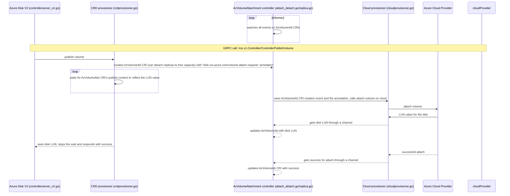

## PublishVolume

```mermaid
    sequenceDiagram      
    %% setup  
        participant driver as Azure Disk V2 (controllerserver_v2.go) 
        participant crdProvisioner as CRD provisioner (crdprovisioner.go)
        participant azVolAttController as AzVolumeAttachment controller (attach_detach.go/replica.go)
        participant cloudProvisioner as Cloud provisioner (cloudprovisioner.go)
        participant azure as Azure Cloud Provider
            
        loop informer
            azVolAttController->>azVolAttController: watches all events on AzVolumeAtt CRIs
        end
        Note over driver, cloudProvider: GRPC call: /csi.v1.Controller/ControllerPublishVolume   
		
    %% request
        driver ->> crdProvisioner: publish volume      

        crdProvisioner -->> azVolAttController: creates AzVolumeAtt CRI (can detach replicas to free capacity) with "disk.csi.azure.com/volume-attach-request" annotation

        loop     
            crdProvisioner ->> crdProvisioner: waits for AzVolumeAtts CRI's publish context to reflect the LUN value
        end
                
        azVolAttController ->> cloudProvisioner: sees AzVolumeAtt CRI creation event and the annotation, calls attach volume on cloud
                
        cloudProvisioner ->> azure: attach volume
                
    %% response
        azure ->> cloudProvisioner: LUN value for the disk
                
        cloudProvisioner -->> azVolAttController: gets disk LUN through a channel
         
        azVolAttController -->> azVolAttController: updates AzVolumeAtt with disk LUN        

        crdProvisioner -->> driver: sees disk LUN, stops the wait and responds with success

        azure -->> cloudProvisioner: successful attach           

        cloudProvisioner -->> azVolAttController: gets success for attach through a channel
         
        azVolAttController -->> azVolAttController: updates AzVolumeAtt CRI with success
         
```