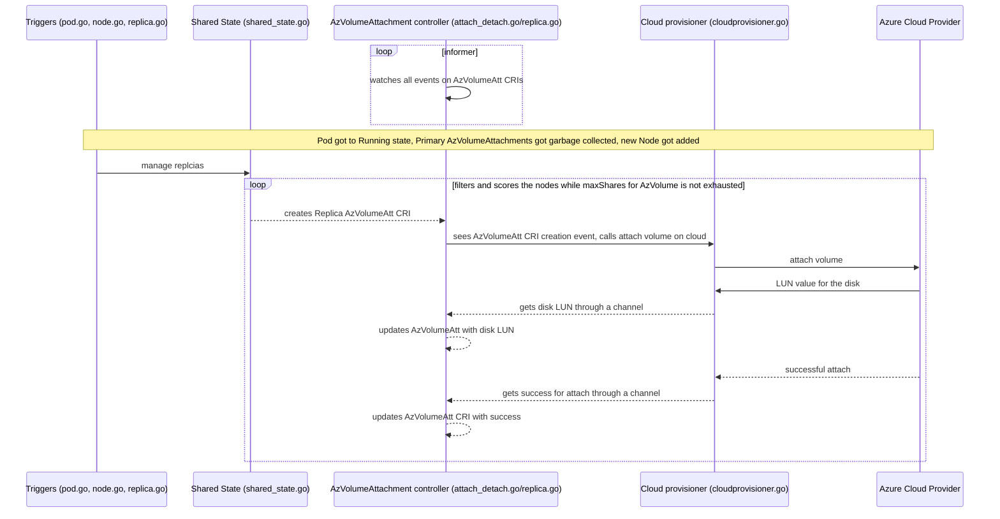

## CreateReplica

```mermaid
    sequenceDiagram      
    %% setup  
        participant trigger as Triggers (pod.go, node.go, replica.go) 
        participant sharedState as Shared State (shared_state.go)
        participant azVolAttController as AzVolumeAttachment controller (attach_detach.go/replica.go)
        participant cloudProvisioner as Cloud provisioner (cloudprovisioner.go)
        participant azure as Azure Cloud Provider
            
        loop informer
            azVolAttController->>azVolAttController: watches all events on AzVolumeAtt CRIs
        end
        Note over trigger, azure: Pod got to Running state, Primary AzVolumeAttachments got garbage collected, new Node got added   
		
    %% request
        trigger ->> sharedState: manage replcias      
        loop  filters and scores the nodes while maxShares for AzVolume is not exhausted   
            sharedState -->> azVolAttController: creates Replica AzVolumeAtt CRI 
             
            azVolAttController ->> cloudProvisioner: sees AzVolumeAtt CRI creation event, calls attach volume on cloud
                    
            cloudProvisioner ->> azure: attach volume
                    
        %% response
            azure ->> cloudProvisioner: LUN value for the disk
                    
            cloudProvisioner -->> azVolAttController: gets disk LUN through a channel
    
            azVolAttController -->> azVolAttController: updates AzVolumeAtt with disk LUN     

            azure -->> cloudProvisioner: successful attach           

            cloudProvisioner -->> azVolAttController: gets success for attach through a channel

            azVolAttController -->> azVolAttController: updates AzVolumeAtt CRI with success
    end
```
