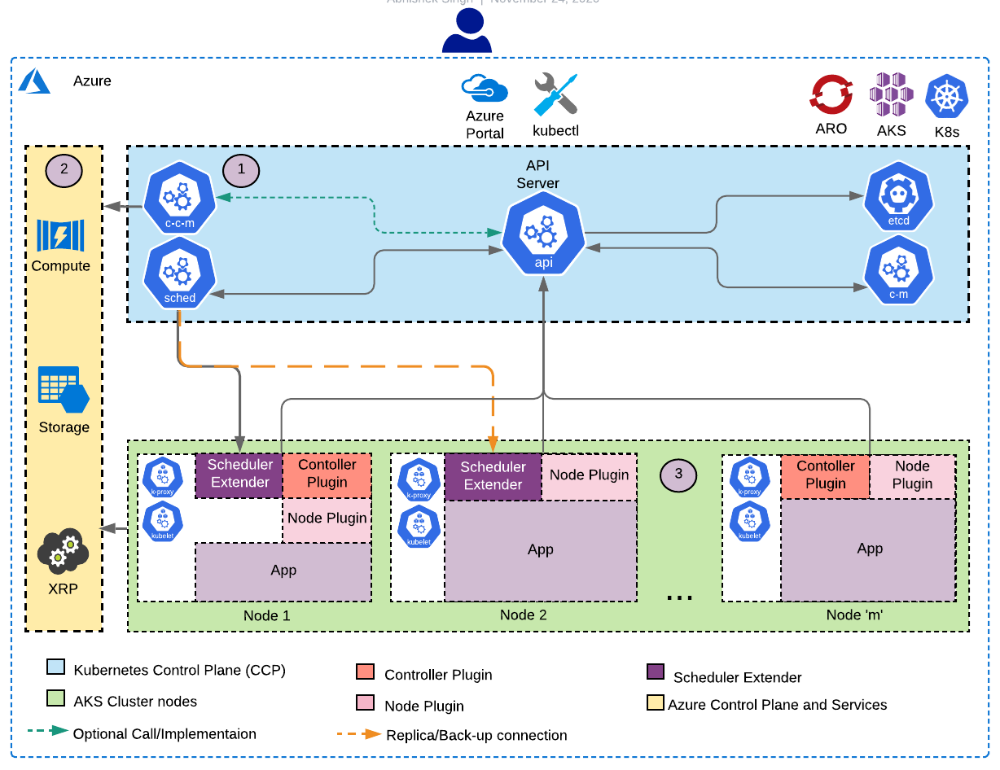

# Azure Disk CSI Driver V2

Azure Disk CSI Driver V2 improves scalability and reduces pod failover latency. It uses shared disks to provision attachment replicas on multiple cluster nodes and integrates with the pod scheduler to ensure a node with an attachment replica is chosen on pod failover.

## Architecture and Components

The diagram below shows the components in the Kubernetes control plane (CCP) and cluster nodes, and the Azure services the Azure Disk CSI Driver V2 uses.

### Controller Plug-in

In addition to the CSI Controller API Server, this plug-in hosts several controllers for custom resources used to orchestrate persistent volume management and node placement.

The controller plug-in is deployed as a [ReplicaSet](https://kubernetes.io/docs/concepts/workloads/controllers/replicaset/) through [Deployment](https://kubernetes.io/docs/concepts/workloads/controllers/deployment/) with leader election.

### Node Plug-in

In addition to the CSI Node API Server, this plug-in also provides feedback for pod placement used by the scheduler extender described below.

The node plug-in is deployed on each node in the cluster as a [DaemonSet](https://kubernetes.io/docs/concepts/workloads/controllers/daemonset/).

### Scheduler Extender Plug-in

Azure Disk CSI Driver V2 provides a [scheduler extender](https://github.com/kubernetes/community/blob/master/contributors/design-proposals/scheduling/scheduler_extender.md) that is responsible for influencing pod placements.

Like the controller plug-in, the scheduler extender is deployed as a [ReplicaSet](https://kubernetes.io/docs/concepts/workloads/controllers/replicaset/) through [Deployment](https://kubernetes.io/docs/concepts/workloads/controllers/deployment/) with leader election.

## Implementation

This section describes the changes and high-level implementation details of the different components in the Azure Disk CSI Driver V2.

### StorageClass

In addition to the existing StorageClass parameters described in [driver-parameters](driver-parameters.md), the Azure Disk CSI Driver V2 supports the following:

| Name | Meaning  | Available Value | Mandatory | Default value |
|------|----------|-----------------|-----------|---------------|
| `maxShares` | The total number of shared disk mounts allowed for the disk. Setting the value to 2 or more enables attachment replicas. | Supported values depend on the disk size. See [Share an Azure managed disk](https://docs.microsoft.com/en-us/azure/virtual-machines/disks-shared) for supported values. | No | 1 |
| `maxMountReplicaCount` | The number of replicas attachments to maintain. | This value must be in the range `[0..(maxShares - 1)]` | No | If `accessMode` is `ReadWriteMany`, the default is `0`. Otherwise, the default is `maxShares - 1` |

### Custom Resources and Controllers

The Azure Disk CSI Driver V2 uses 3 different custom resources defined in the `azure-disk-csi` namespace to orchestrate disk management and facilitate pod failover to nodes with attachment replica. A controller for each resource watches for and responds to changes to its custom resource instances.

#### `AzDriverNode` Resource and Controller

The `AzDriverNode` custom resource represents a node in the cluster where the V2 node plug-in runs. An instance of `AzDriverNode` is created when the node plug-in starts. The node plug-in periodically updates the heartbeat in the `Status` field.

The controller for `AzDriverNode` runs in the controller plug-in. It is responsible for deleting `AzDriverNode` instances that no longer have corresponding nodes in the cluster.

#### `AzVolume` Resource and Controller

The `AzVolume` custom resource represents the managed disk of a `PersistentVolume`. The controller for `AzVolume` runs in the controller plug-in. It watches for and reconciles changes in the `AzVolume` instances.

An `AzVolume` instance is created by the `CreateVolume` API to the CSI Controller plug-in. The `AzVolume` controller responds to the new instance by creating a managed disk using the parameters in the referenced `StorageClass`. When disk creation is complete, the controller sets the `.Status.State` field to `Created` or suitable error state on failure. The `CreateVolume` request completes when the `AzVolume` state is updated.

To delete a managed disk, the `DeleteVolume` API in the CSI Controller plug-in schedules the corresponding `AzVolume` instance for deletion. The controller responds by garbage collecting the managed disk. When the managed disk has been deleted, the controller deletes the `AzVolume` instance. The `DeleteVolume` request completes once the `AzVolume` instance has been removed from the object store.

#### `AzVolumeAttachment` Resource and Controller

The `AzVolumeAttachment` custom resource represents the attachment of a managed disk to a specific node. The controller for this custom resource runs in the controller plug-in and watches for changes in the `AzVolumeAttachment` instances.

An `AzVolumeAttachment` instance representing the primary node attachment is created by the `ControllerPublishVolume` API in the CSI Controller plug-in. If an instance for the current node already exists, it is updated to represent the primary node attachment. The `AzVolumeAttachment` controller then attaches the managed disk to the primary node if it was not already attached as an attachment replica. It then creates additional `AzVolumeAttachment` instances representing attachment replicas and attaches the shared managed disk to a number of backup nodes as specified by the `maxMountReplicaCount` parameter in the `StorageClass` instance of the `PersistentVolumeClaim` of the managed disk. The `ControllerPublishVolume` request is complete once the `AzVolumeAttachment` instance for primary node has been created. As each the attachment request completes, the controller sets the `.Status.State` field to `Attached`. When the `NodeStageVolume` API is called, the CSI Node plug-in will wait for the its `AzVolumeAttachment` instance's state to reach `Attached` before staging the mount point to the disk.

When the `ControllerUnpublishVolume` API in the CSI Controller plug-in is called, it schedules the `AzVolumeAttachment` instance of the primary node for deletion. The controller responds by detaching the managed disk from the primary node. The `AzVolumeAttachment` instance is deleted When the detach operation completes, and schedules garbage collection to detach and delete the attachment replicas if no subsequent `ControllerPublishVolume` request is made for the disk within 5 minutes. The `ControllerUnpublishVolume` request is complete when the detach operation has completed and corresponding `AzVolumeAttachment` has been removed from the object store.

### Scheduler Extender

The Azure Disk CSI Driver V2 scheduler extender influences pod placement by prioritizing healthy nodes where attachment replicas for the required persistent volume(s) already exist (i.e. node(s) to which the managed disk(s) is(are) already attached). It relies on the `AzVolumeAttachment` instances to determine which nodes have attachment replicas, and the heartbeat information in the `AzDriverNode` to determine health. If no attachment replicas for the specified persistent volume currently exist, the scheduler extender will weight all nodes equally.

### Provisioner Library

The Provisioner Library is a common library to abstract the underlying platform for all the V2 driver plugins, services and controllers. It handles the platform-specific details of performing volume operations such as (but not necessarily limited to) create, delete, attach, detach, snapshot, stage, unstage, mount, unmount, etc.
